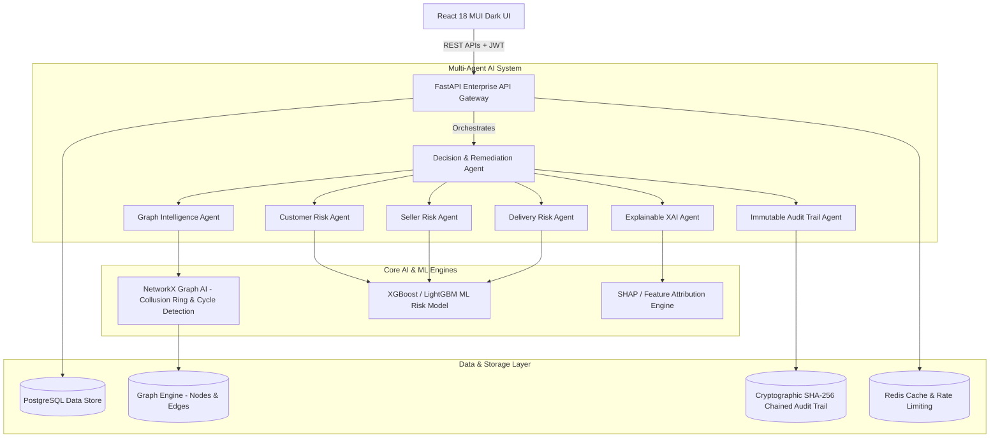
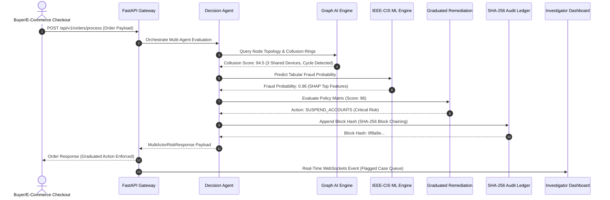
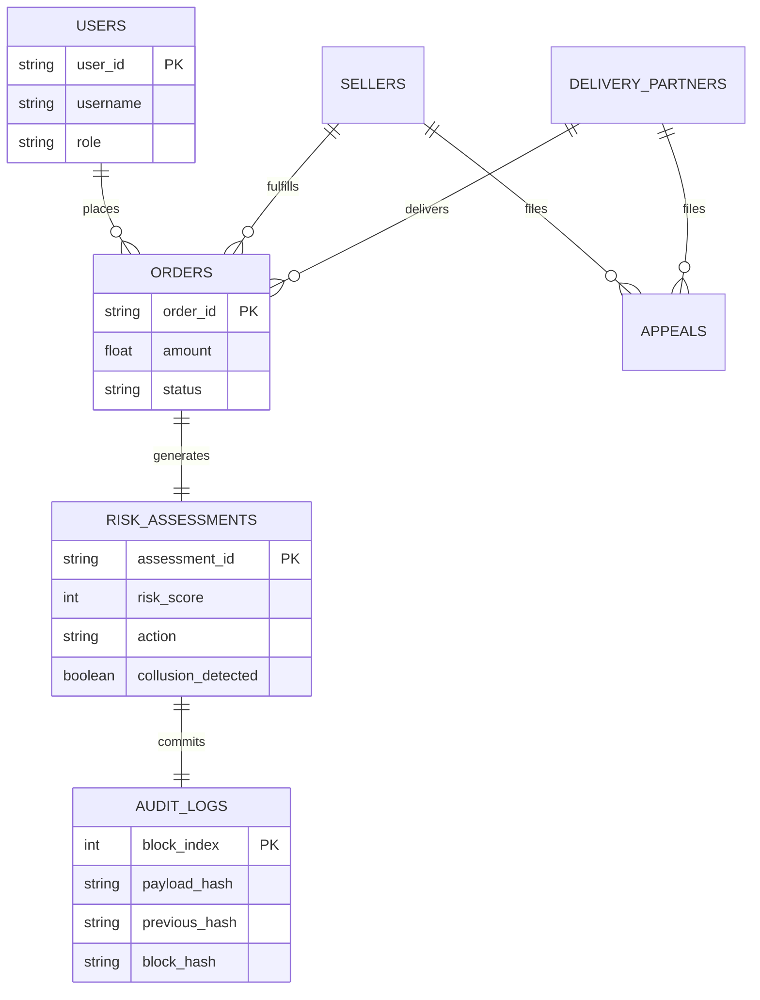

# System Architecture & Technical Specifications - Trust Graph Platform

## 1. High-Level Enterprise Microservices Architecture

---

## 2. Order Processing & Multi-Agent Risk Sequence Diagram

---

## 3. Data Models & Entity Relationship Diagram

